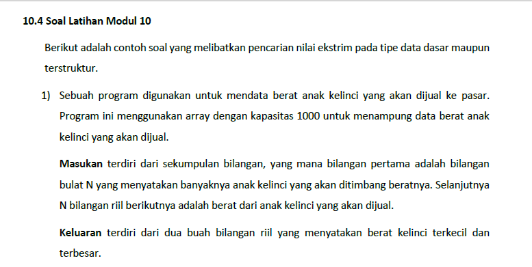
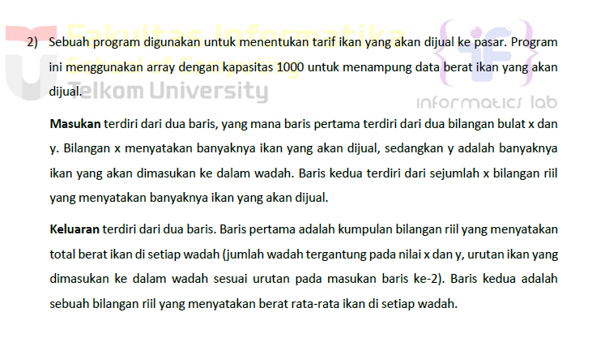
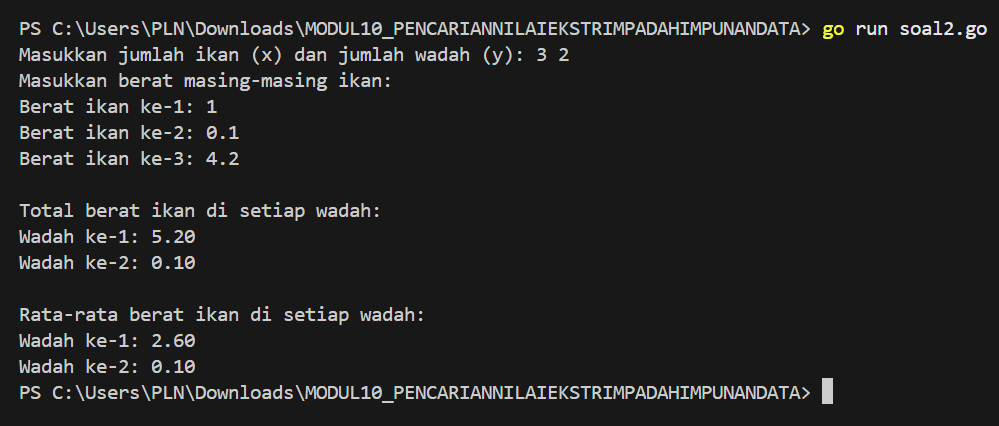
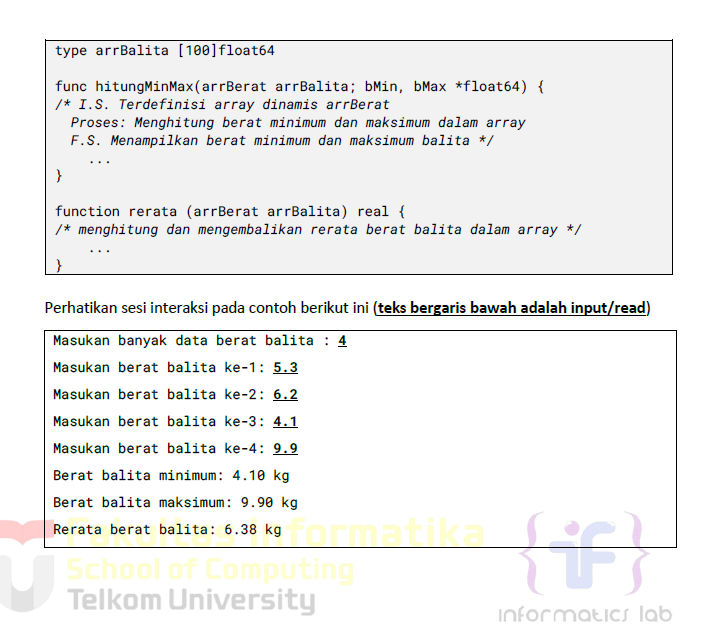
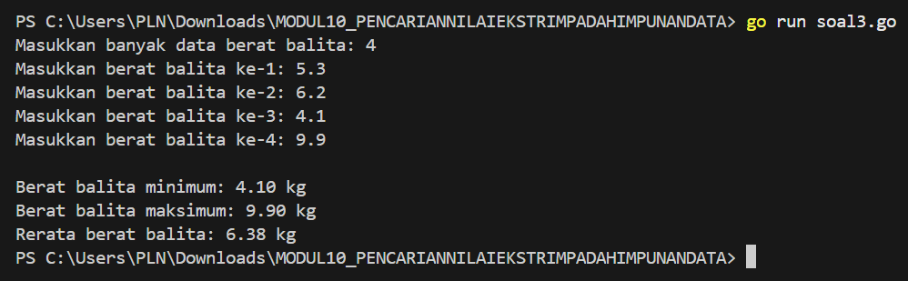

# <h1 align="center">Laporan Praktikum Modul 10 <br> PENCARIAN NILAI EKSTRIM PADA HIMPUNAN DATA</h1>
<p align="center">ESTETIKA ANANDA POETRI HARIYANTO - 103112400272</p>

## Dasar Teori

Pencarian nilai ekstrim (maksimum atau minimum) adalah proses menemukan elemen terbesar atau terkecil dalam sebuah himpunan data. Ini merupakan salah satu proses dasar dalam algoritma pemrograman dan banyak diaplikasikan dalam berbagai kasus kehidupan nyata, seperti:
Mencari file terbesar dalam direktori, Menentukan suhu tertinggi dari data cuaca, Menentukan nilai tertinggi/terendah siswa.

Algoritma pencarian nilai ekstrim bekerja secara sekuensial dan sederhana:
1. Asumsikan elemen pertama sebagai nilai ekstrim (maksimum atau minimum).
2. Bandingkan elemen tersebut dengan elemen-elemen lainnya satu per satu:
    - Jika menemukan elemen yang lebih ekstrim, perbarui nilai tersebut.
3. Setelah semua elemen dicek, nilai yang tersimpan adalah nilai ekstrim yang dicari.

## Unguided

## NO 1

>

```go
package main

import (
    "fmt"
)
func main() {
    var n int
    fmt.Print("Masukkan jumlah anak kelinci: ")
    fmt.Scan(&n)
    if n <= 0 || n > 1000 {
        fmt.Println("Jumlah anak kelinci harus antara 1 dan 1000.")
        return
    }
    berat := make([]float64, n)
    fmt.Println("Masukkan berat masing-masing anak kelinci:")
    for i := 0; i < n; i++ {
        fmt.Printf("Berat ke-%d: ", i+1)
        fmt.Scan(&berat[i])
    }
    terkecil := berat[0]
    terbesar := berat[0]
    for i := 1; i < n; i++ {
        if berat[i] < terkecil {
            terkecil = berat[i]
        }
        if berat[i] > terbesar {
            terbesar = berat[i]
        }
    }
    fmt.Printf("Berat terkecil: %.2f\n", terkecil)
    fmt.Printf("Berat terbesar: %.2f\n", terbesar)
}
```

> Output


Program ini dibuat menggunakan bahasa golang dan berfungsi untuk mendata berat anak kelinci yang akan dijual di pasar, kemudian mencari berat yang **terkecil** dan **terbesar** dari data yang dimasukkan oleh pengguna.

Pertama, program meminta pengguna memasukkan sebuah angka bulat `n` yang menunjukkan jumlah anak kelinci. Setelah itu, program akan meminta pengguna untuk memasukkan berat dari masing-masing anak kelinci sebanyak `n` kali. Berat ini disimpan dalam sebuah array bertipe `float64` karena data berat bisa berupa angka desimal.

Setelah seluruh berat dimasukkan, program akan membandingkan setiap elemen di dalam array untuk mencari nilai yang paling kecil dan paling besar. Nilai terkecil dan terbesar ini kemudian akan ditampilkan ke layar dengan format dua angka di belakang koma.

Program juga memiliki validasi untuk memastikan bahwa jumlah anak kelinci yang dimasukkan tidak kurang dari 1 dan tidak lebih dari 1000, sesuai dengan batas kapasitas array yang disebutkan di soal. Jika jumlah tidak valid, program akan menghentikan proses dan memberikan peringatan kepada pengguna.

Secara keseluruhan, program ini adalah contoh sederhana bagaimana cara menggunakan array, input dari pengguna, dan proses pencarian nilai ekstrem (minimum dan maksimum) dalam sebuah kumpulan data di bahasa Golang.
## NO 2

>

```go
package main

import (
    "fmt"
)
func main() {
    var x, y int
    fmt.Print("Masukkan jumlah ikan (x) dan jumlah wadah (y): ")
    fmt.Scan(&x, &y)
    if x <= 0 || y <= 0 || x > 1000 || y > 1000 {
        fmt.Println("Nilai x dan y harus antara 1 hingga 1000.")
        return
    }
    beratIkan := make([]float64, x)
    fmt.Println("Masukkan berat masing-masing ikan:")
    for i := 0; i < x; i++ {
        fmt.Printf("Berat ikan ke-%d: ", i+1)
        fmt.Scan(&beratIkan[i])
    }

    //inisialisasi array total dan rata-rata per wadah
    totalPerWadah := make([]float64, y)
    jumlahIkanPerWadah := make([]int, y)

    //masukkan ikan ke wadah berdasarkan urutan
    for i := 0; i < x; i++ {
        indexWadah := i % y
        totalPerWadah[indexWadah] += beratIkan[i]
        jumlahIkanPerWadah[indexWadah]++
    }

    //cetak total berat di setiap wadah
    fmt.Println("\nTotal berat ikan di setiap wadah:")
    for i := 0; i < y; i++ {
        fmt.Printf("Wadah ke-%d: %.2f\n", i+1, totalPerWadah[i])
    }

    //cetak rata-rata berat ikan di setiap wadah
    fmt.Println("\nRata-rata berat ikan di setiap wadah:")
    for i := 0; i < y; i++ {
        rataRata := totalPerWadah[i] / float64(jumlahIkanPerWadah[i])
        fmt.Printf("Wadah ke-%d: %.2f\n", i+1, rataRata)
    }
}
```

> Output


Input:
x : jumlah ikan
y : jumlah wadah
setelah itu dimasukan berat dari masing masing ikan sebanyak x kali.

ikan dimasukan ke dalam wadah secara berurutan pakai i % y
dan setiap wadah menyimpan total berat dan jumlah ikannya.

output nya yaitu total berat di setiap wadah dan rata rata berat ikan di setiap wadah.
## NO 3

Pos pelayanan terpadu (posyandu) sebagai tempat pelayanan kesehatan perlu mencatat data berat balita (dalam kg). petugas akan memasukan data tersebut ke dalam array. dari data yang diperoleh akan dicari berat balita terkecil, terbesar, dan reratanya.
buatlah program dengan spesifikasi subprogram sbg berikut :

>

```go
package main

import (
    "fmt"
)

//subprogram untuk menghitung nilai minimum dan maksimum
func hitungMinMax(arr []float64, bMin, bMax *float64) {
    *bMin = arr[0]
    *bMax = arr[0]
    for i := 1; i < len(arr); i++ {
        if arr[i] < *bMin {
            *bMin = arr[i]
        }
        if arr[i] > *bMax {
            *bMax = arr[i]
        }
    }
}
  
//subprogram untuk menghitung rata-rata
func rataRata(arr []float64) float64 {
    var total float64
    for _, v := range arr {
        total += v
    }
    return total / float64(len(arr))
}

func main() {
    var n int
    fmt.Print("Masukkan banyak data berat balita: ")
    fmt.Scan(&n)
    if n <= 0 || n > 100 {
        fmt.Println("Jumlah data harus antara 1 dan 100.")
        return
    }

    //input data berat balita
    berat := make([]float64, n)
    for i := 0; i < n; i++ {
        fmt.Printf("Masukkan berat balita ke-%d: ", i+1)
        fmt.Scan(&berat[i])
    }

    //hitung min, max, dan rata-rata
    var min, max float6
    hitungMinMax(berat, &min, &max)
    rata := rataRata(berat)

    //Output
    fmt.Printf("\nBerat balita minimum: %.2f kg\n", min)
    fmt.Printf("Berat balita maksimum: %.2f kg\n", max)
    fmt.Printf("Rerata berat balita: %.2f kg\n", rata)
}
```

> Output
> 

Program ini bertujuan untuk mencatat berat badan balita dalam satu array dan menentukan berat balita terkecil, terbesar, dan rerata dari data yang dimasukan.

Untuk melakukan hal tersebut, program menggunakan dua fungsi:

- Fungsi pertama bernama `hitungMinMax`, yang bertugas mencari nilai terkecil dan terbesar dalam array.
    
- Fungsi kedua bernama `rataRata`, yang menghitung rata-rata dari seluruh data berat balita.
    

Hasil akhirnya akan ditampilkan ke layar berupa berat minimum, maksimum, dan rata-rata balita dalam satuan kilogram dengan dua angka di belakang koma


