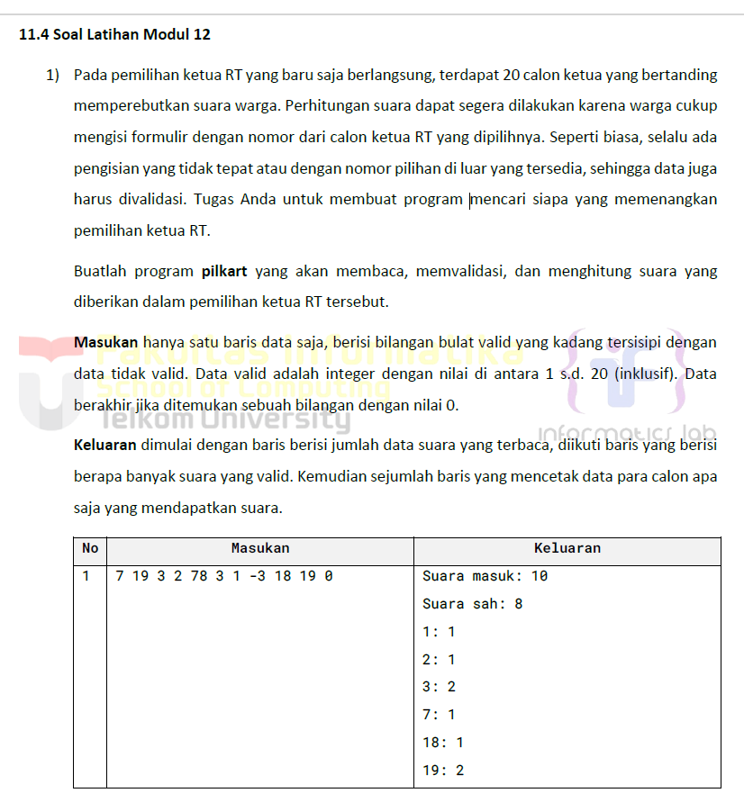
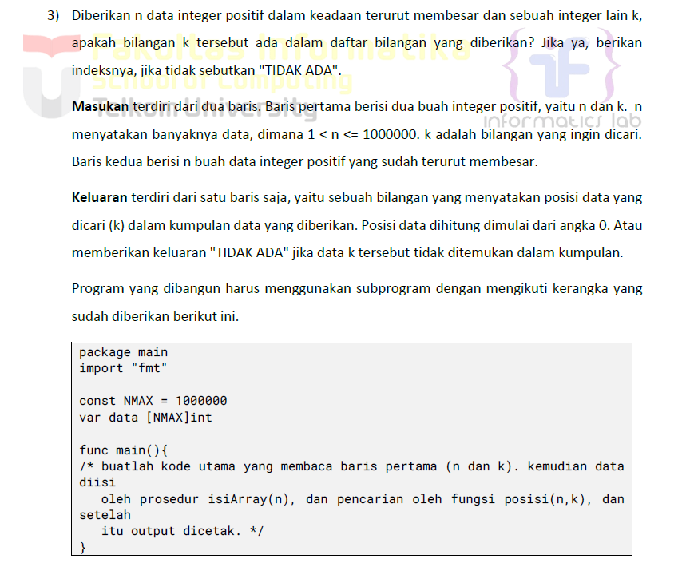
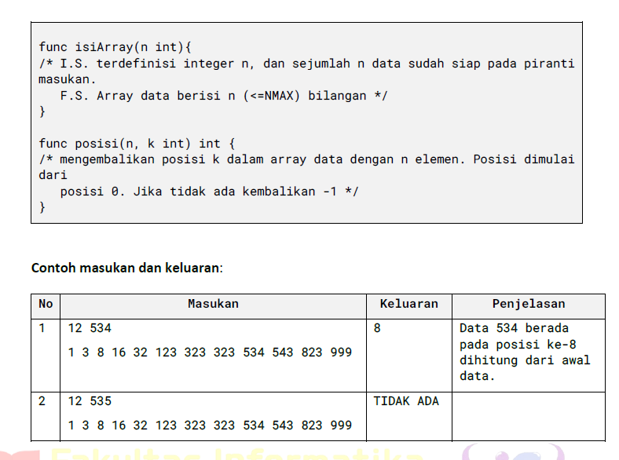

# <h1 align="center">Laporan Praktikum Modul 11 <br> PENCARIAN NILAI ACAK PADA HIMPUNAN DATA</h1>
<p align="center">ESTETIKA ANANDA POETRI HARIYANTO - 103112400272</p>

## Dasar Teori

**1. Pencarian Sekuensial (Sequential Search)**  
Pencarian sekuensial adalah metode pencarian data yang dilakukan dengan memeriksa elemen satu per satu, dimulai dari indeks pertama hingga elemen terakhir dalam array. Pencarian ini akan berhenti jika data yang dicari ditemukan, atau jika seluruh elemen telah diperiksa. Kelebihan dari metode ini adalah kemudahannya dalam implementasi dan tidak memerlukan data yang terurut. Namun, kelemahannya terletak pada efisiensi waktu, terutama jika jumlah data sangat besar.

**2. Pencarian Biner (Binary Search)**  
Pencarian biner merupakan algoritma pencarian yang lebih efisien, namun hanya dapat digunakan jika data telah terurut, baik secara menaik (ascending) maupun menurun (descending). Metode ini bekerja dengan cara membagi rentang data menjadi dua bagian, lalu membandingkan nilai tengah dengan nilai yang dicari. Jika nilai tengah lebih kecil dari nilai yang dicari, maka pencarian dilanjutkan pada setengah bagian kanan; sebaliknya, jika lebih besar, pencarian dilakukan pada bagian kiri. Proses ini dilakukan secara berulang hingga data ditemukan atau rentang pencarian habis.

**3. Pencarian pada Array Bertipe Struct**  
Ketika data disimpan dalam bentuk array of struct, pencarian tetap dapat dilakukan menggunakan algoritma sequential atau binary. Pada pencarian menggunakan struct, perbandingan dilakukan berdasarkan salah satu field dalam struct, seperti `nama`, `nim`, atau lainnya. Jika ingin menggunakan binary search, maka array harus diurutkan berdasarkan field yang menjadi dasar pencarian.

## Guided

## NO 1

Sebuah toko memiliki daftar nama barang sebanyak n buah, setiap nama barang disimpan dalam array bertipe string. buatlah program untuk mencari apakah nama barang yang dicari (x) tersedia di toko atau tidak. pencarian dilakukan menggunakan algoritma sequential search program mengembalikan true jika barang ditemukan atau false jika tidak ditemukan.
n = 5
data = ["sabun", "sampo", "odol", "tisu", "minyak"]
x= "odol"
output nya barang ditemukan true

```go
package main

import "fmt"

func cariBarang(daftar []string, x string) bool {
    for _, barang := range daftar {
        if barang == x {
            return true
        }
    }
    return false
}
func main() {
    var n int
    fmt.Print("Masukkan jumlah barang: ")
    fmt.Scan(&n)
    daftarBarang := make([]string, n)
    fmt.Println("Masukkan nama-nama barang:")
    for i := 0; i < n; i++ {
        fmt.Scan(&daftarBarang[i])
    }
    var barangDicari string
    fmt.Print("Masukkan nama barang yang dicari: ")
    fmt.Scan(&barangDicari)
    ditemukan := cariBarang(daftarBarang, barangDicari)
    fmt.Println(ditemukan)
}
```

>Output
>![[guided1.png]]

Program ini untuk user memasukkan daftar barang, lalu program mengecek apakah barang tertentu ada di daftar dan mencetak `true` atau `false`.

## NO 2

Buat program untuk membaca sebuah kalimat (string) dan sebuah karakter yang ingin dicari gunakan sequential search untuk mencari apakah karakter tersebut terdapat di dalam kalimat jika ya, tampilkan semua posisi (indeks) karakter tersebut di kalimat.  kalimat = "algoritma pemrograman" karakter = "a"  output karakter ditemukan pada indeks : 0, 8, 16, 18.

```go
package main

import (
    "bufio"
    "fmt"
    "os"
    "strings"
)
func main() {
    reader := bufio.NewReader(os.Stdin)
    // Input kalimat
    fmt.Print("Masukkan kalimat: ")
    kalimat, _ := reader.ReadString('\n')
    kalimat = strings.TrimSpace(kalimat)

    // Input karakter
    fmt.Print("Masukkan karakter yang dicari: ")
    inputKarakter, _ := reader.ReadString('\n')
    inputKarakter = strings.TrimSpace(inputKarakter)

    // Validasi input karakter hanya satu huruf
    if len(inputKarakter) != 1 {
        fmt.Println("Masukkan harus berupa satu karakter.")
        return
    }

    karakter := rune(inputKarakter[0])
    var indeks []int
  
    // Sequential search
    for i, ch := range kalimat {
        if ch == karakter {
            indeks = append(indeks, i)
        }
    }

    // Output hasil pencarian
    if len(indeks) > 0 {
        fmt.Print("Karakter ditemukan pada indeks : ")
        for i, idx := range indeks {
            if i > 0 {
                fmt.Print(", ")
            }
            fmt.Print(idx)
        }
        fmt.Println()
    } else {
        fmt.Println("Karakter tidak ditemukan.")
    }
}
```

>Output
>![[guided2.png]]

- User input kalimat dan satu karakter.
- Program mencari **semua posisi** karakter dalam kalimat.
- Tampilkan semua posisi (indeks) jika ketemu, atau pesan "Karakter tidak ditemukan" kalau tidak ada.

## NO 3

CARI NIM MAHASISWA DENGAN BINARY SEARCH
diketahui array mahasiswa terdiri atas n data bertipe struct yang menyimpan data nama dan nim mahasiswa. array sudah terurut membesar berdasarkan nim. buatlah program untuk mencari nim tertentu menggunakan algoritma binary search dan mengembalikan indeks dari nim tersebut

n = 4
mahasiswa = [{nama: "Andi", nim: 220001"},
{nama: "Budi", nim: "220002"},
{nama: "Citra", nim: "220003"},
{nama: "Dina", nim: "220004"}]

x = "220003"

Output
Indeks mahasiswa ditemukan 2

```go
package main

import "fmt"
type Mahasiswa struct {
    NIM  string
    Nama string
}

func binarySearch(mahasiswa []Mahasiswa, target string) int {
    left := 0
    right := len(mahasiswa) - 1
    for left <= right {
        mid := left + (right-left)/2
        if mahasiswa[mid].NIM == target {
            return mid
        }
        if mahasiswa[mid].NIM > target {
            right = mid - 1
        } else {
            left = mid + 1
        }
    }
    return -1
}

func main() {
    mahasiswa := []Mahasiswa{
        {Nama: "Andi", NIM: "220001"},
        {Nama: "Budi", NIM: "220002"},
        {Nama: "Citra", NIM: "220003"},
        {Nama: "Dina", NIM: "220004"},
    }

    x := "220003"  

    index := binarySearch(mahasiswa, x)
    if index != -1 {
        fmt.Println("Indeks Mahasiswa ditemukan: ",index)
    } else {
        fmt.Println("NIM tidak ditemukan.")
    }
}
```

>Output
>![[guided3.png]]

Program ini mencari posisi NIM dalam daftar mahasiswa menggunakan binary search yang cepat dan efisien.

## Unguided

## NO 1

>

```go
package main

import (
    "fmt"
)

func main() {
    var input int
    var suaraMasuk, suaraSah int
    hitungSuara := make(map[int]int)
    for {
        fmt.Scan(&input)
        if input == 0 {
            break
        }
        suaraMasuk++
        if input >= 1 && input <= 20 {
            suaraSah++
            hitungSuara[input]++
        }
    }
    fmt.Println("Suara masuk:", suaraMasuk)
    fmt.Println("Suara sah:", suaraSah)
    for i := 1; i <= 20; i++ {
        if hitungSuara[i] > 0 {
            fmt.Printf("%d: %d\n", i, hitungSuara[i])
        }
    }
}
```

>Output
>![[MODUL11_PENCARIANNILAIACAKPADAHIMPUNANDATA/Output/ss1.png]]

- Input angka satu per satu.
- Jika input `0`, berarti berhenti membaca input.
- Hitung:
    - `suaraMasuk`: semua input sebelum 0.
    - `suaraSah`: input valid (1 sampai 20).
- Data suara per calon disimpan di map[int]int (`hitungSuara`).
- Setelah selesai:
    - Cetak jumlah suara masuk.
    - Cetak jumlah suara sah.
    - Cetak jumlah suara tiap calon yang dapat suara.

## NO 2

Berdasarkan program sebelumnya, buat program pilkart yang mencari siapa pemenang pemilihan ketua RT. Sekaligus juga ditentukan bahwa wakil ketua RT adalah calon yang mendapatkan suara terbanyak kedua. Jika beberapa calon mendapatkan suara terbanyak yang sama, ketua terpilih adalah dengan nomor peserta yang paling kecil dan wakilnya dengan
nomor peserta terkecil berikutnya.
Masukan hanya satu baris data saja, berisi bilangan bulat valid yang kadang tersisipi dengan data tidak valid. Data valid adalah bilangan bulat dengan nilai di antara 1 s.d. 20 (inklusif). Data berakhir jika ditemukan sebuah bilangan dengan nilai 0.
Keluaran dimulai dengan baris berisi jumlah data suara yang terbaca, diikuti baris yang berisi berapa banyak suara yang valid. Kemudian tercetak calon nomor berapa saja yang menjadi pasangan ketua RT dan wakil ketua RT yang baru.

```go
package main

import (
    "fmt"
    "sort"
)

func main() {
    var input int
    var suaraMasuk, suaraSah int
    hitungSuara := make(map[int]int)
    for {
        fmt.Scan(&input)

  if input == 0 {
            break
        }

        suaraMasuk++
        if input >= 1 && input <= 20 {
            suaraSah++
            hitungSuara[input]++
        }
    }

    fmt.Println("Suara masuk:", suaraMasuk)
    fmt.Println("Suara sah:", suaraSah)

    // Cari calon ketua dan wakil
    type calon struct {
        nomor int
        suara int
    }
    var daftar []calon
    for i := 1; i <= 20; i++ {
        if hitungSuara[i] > 0 {
            daftar = append(daftar, calon{nomor: i, suara: hitungSuara[i]})
        }
    }
    sort.Slice(daftar, func(i, j int) bool {
        if daftar[i].suara == daftar[j].suara {
            return daftar[i].nomor < daftar[j].nomor
        }
        return daftar[i].suara > daftar[j].suara
    })
    if len(daftar) > 0 {
        fmt.Println("Ketua RT:", daftar[0].nomor)
    }
    if len(daftar) > 1 {
        fmt.Println("Wakil ketua:", daftar[1].nomor)
    }
}
```

>Output
>![[MODUL11_PENCARIANNILAIACAKPADAHIMPUNANDATA/Output/ss2.png]]

- Baca input suara satu per satu.    
- Hitung suara masuk dan suara sah.
- Simpan suara dalam map `hitungSuara`.
- Buat slice `daftar` untuk calon yang punya suara.
- Sortir:
    - Urutkan berdasarkan suara terbanyak.
    - Jika suara sama, pilih nomor calon terkecil.
- Cetak:
    - Ketua RT (pemenang 1)
    - Wakil Ketua RT (pemenang 2)
## NO 3

>
>

```go
package main
import "fmt"
const NMAX = 1000000
var data [NMAX]int
func isiArray(n int) {
    for i := 0; i < n; i++ {
        fmt.Scan(&data[i])
    }
}
func posisi(n, k int) int {
    left, right := 0, n-1
    for left <= right {
        mid := (left + right) / 2
        if data[mid] == k {
            return mid
        } else if data[mid] < k {
            left = mid + 1
        } else {
            right = mid - 1
        }
    }
    return -1
}
func main() {
    var n, k int
    fmt.Scan(&n, &k)
    isiArray(n)
    pos := posisi(n, k)
    if pos != -1 {
        fmt.Println(pos)
    } else {
        fmt.Println("TIDAK ADA")
    }
}
```

>Output
>![[MODUL11_PENCARIANNILAIACAKPADAHIMPUNANDATA/Output/ss3.png]]

- `isiArray(n)` untuk membaca `n` data ke array `data`.
- `posisi(n, k)` untuk mencari posisi `k` menggunakan binary search karena data sudah terurut membesar.
- Di `main()`, kita input `n` dan `k`, isi array, lalu cari posisinya.


