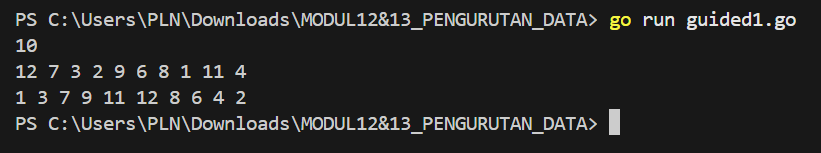
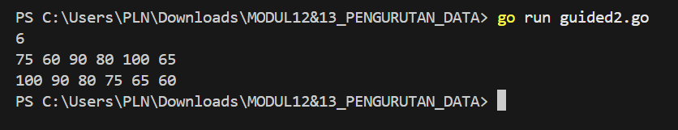
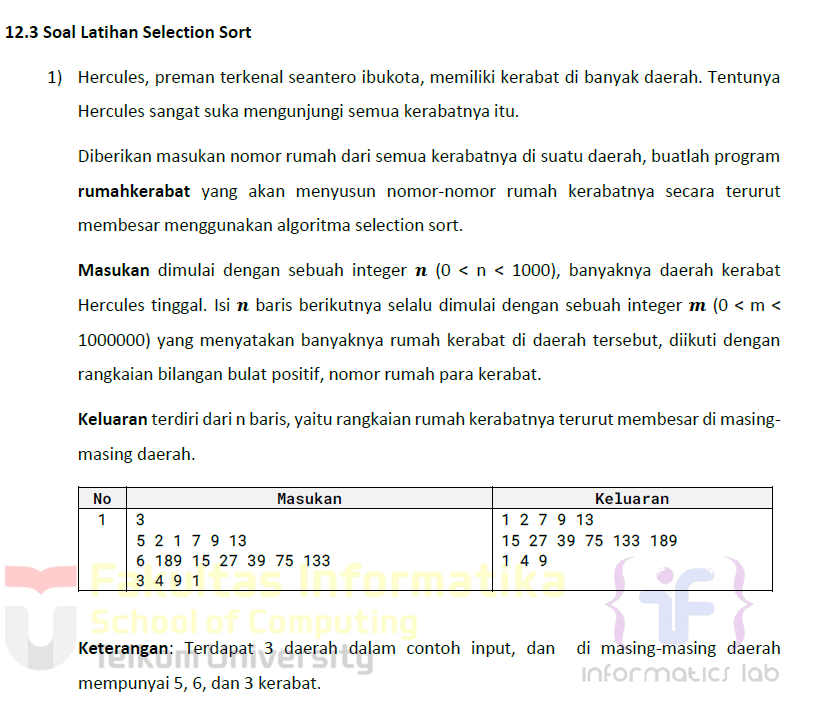
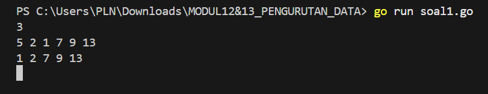
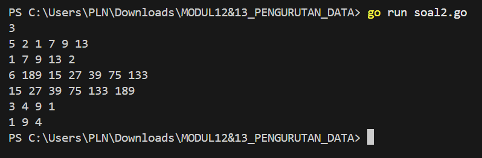
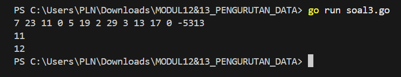
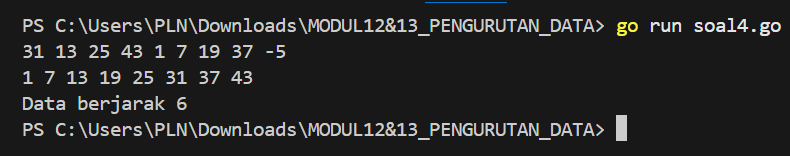

# <h1 align="center">Laporan Praktikum Modul 12 & 13 <br> PENGURUTAN DATA</h1>
<p align="center">ESTETIKA ANANDA POETRI HARIYANTO - 103112400272</p>

## Dasar Teori

Pengurutan secara seleksi ini idenya adalah mencari nilai ekstrim pada sekumpulan data, kemudian meletakkan pada posisi yang seharusnya. Pada penjelasan berikut ini data akan diurut membesar (ascending), dan data dengan indeks kecil ada di "kiri" dan indeks besar ada di "kanan".
1) Cari nilai terkecil di dalam rentang data tersisa
2) Pindahkan/tukar tempat dengan data yang berada pada posisi paling kiri pada rentang data tersisa tersebut.
3) Ulangi proses ini sampai tersisa hanya satu data saja.

## Guided

## NO 1

### Urut Ganjil Genap
Diberikan `n` bilangan bulat positif. Buat program untuk mengurutkan angka ganjil secara **membesar (ascending)** dan angka genap secara **mengecil (descending)**, lalu gabungkan hasilnya dengan ganjil duluan.
Gunakan **selection sort** dalam proses pengurutan.
**Masukan:**
- Baris pertama berisi bilangan bulat `n` (1 ≤ n ≤ 100).
- Baris kedua berisi `n` bilangan bulat positif.
**Keluaran:**
- Satu baris berisi angka ganjil terurut membesar diikuti angka genap terurut mengecil.
**Contoh Masukan:**
10
12 7 3 2 9 6 8 1 11 4
**Contoh Keluaran:**
1 3 7 9 11 12 8 6 4 2
  

```go
package main
import (
    "fmt"
)
func selectionSortAsc(arr []int) {
    n := len(arr)
    for i := 0; i < n-1; i++ {
        minIdx := i
        for j := i + 1; j < n; j++ {
            if arr[j] < arr[minIdx] {
                minIdx = j
            }
        }
        arr[i], arr[minIdx] = arr[minIdx], arr[i]
    }
}

func selectionSortDesc(arr []int) {
    n := len(arr)
    for i := 0; i < n-1; i++ {
        maxIdx := i
        for j := i + 1; j < n; j++ {
            if arr[j] > arr[maxIdx] {
                maxIdx = j
            }
        }
        arr[i], arr[maxIdx] = arr[maxIdx], arr[i]
    }
}
func main() {
    var n int
    fmt.Scan(&n)
    data := make([]int, n)
    for i := 0; i < n; i++ {
        fmt.Scan(&data[i])
    }
    var ganjil, genap []int
    for _, v := range data {
        if v%2 == 0 {
            genap = append(genap, v)
        } else {
            ganjil = append(ganjil, v)
        }
    }
    selectionSortAsc(ganjil)
    selectionSortDesc(genap)
    for _, v := range ganjil {
        fmt.Print(v, " ")
    }
    for _, v := range genap {
        fmt.Print(v, " ")
    }
    fmt.Println()
}
```

> Output

  
Program ini membaca sejumlah angka, kemudian memisahkan angka ganjil dan genap. Angka ganjil disortir secara ascending (menaik) dan angka genap disortir secara descending (menurun) menggunakan algoritma Selection Sort. Setelah itu, angka ganjil dan genap yang sudah diurutkan ditampilkan secara berurutan.
langkah langkah nya:
1. Inputkan angka `n` (jumlah angka) dan elemen-elemen angka.
2. Pisahkan angka ganjil dan genap.
3. Sortir angka ganjil (ascending) dan angka genap (descending).
4. Tampilkan hasilnya.

## NO 2

### Ranking Nilai Ujian
Sebuah kelas memiliki sejumlah siswa yang telah mengikuti ujian. Tugas Anda adalah membuat program yang membaca nilai-nilai ujian siswa dengan struct berisikan `nim` dan `nilai`, lalu mengurutkannya dari yang tertinggi ke yang terendah menggunakan **insertion sort**.

**Masukan:**
- Baris pertama adalah sebuah bilangan bulat `n` (1 ≤ n ≤ 100), menyatakan jumlah siswa.
- Baris berikutnya berisi `n` bilangan bulat yang masing-masing adalah nilai ujian (0–100).
**Keluaran:**
- Satu baris berisi nilai-nilai yang sudah terurut dari terbesar ke terkecil.

**Contoh Masukan:**
6
75 60 90 80 100 65
**Contoh Keluaran:**
100 90 80 75 65 60

```go
package main
import (
    "fmt"
)

func insertionSortDesc(arr []int) {
    for i := 1; i < len(arr); i++ {
        key := arr[i]
        j := i - 1
        for j >= 0 && arr[j] < key {
            arr[j+1] = arr[j]
            j--
        }
        arr[j+1] = key
    }
}

func main() {
    var n int
    fmt.Scan(&n)
    nilai := make([]int, n)
    for i := 0; i < n; i++ {
        fmt.Scan(&nilai[i])
    }
    insertionSortDesc(nilai)
    for _, v := range nilai {
        fmt.Print(v, " ")
    }
    fmt.Println()
}
```

> Output


Program ini menggunakan **Insertion Sort** untuk mengurutkan angka dalam urutan **menurun**.
1. Input jumlah angka `n`, lalu masukkan `n` angka.
2. Fungsi `insertionSortDesc` mengurutkan angka-angka tersebut dengan membandingkan setiap elemen dan menyisipkannya pada posisi yang tepat, memastikan urutan menurun.
3. Setelah pengurutan, program mencetak angka-angka yang sudah diurutkan dalam urutan menurun.


## Unguided

## NO 1

>

```go
package main

import (
    "fmt"
)

func selectionSort(arr []int) {
    n := len(arr)
    for i := 0; i < n-1; i++ {
        minIdx := i
        for j := i + 1; j < n; j++ {
            if arr[j] < arr[minIdx] {
                minIdx = j
            }
        }
       
        arr[i], arr[minIdx] = arr[minIdx], arr[i]
    }
}

func main() {
    var n int
    fmt.Scan(&n)
    for i := 0; i < n; i++ {
        var m int
        fmt.Scan(&m)
        houses := make([]int, m)
        for j := 0; j < m; j++ {
            fmt.Scan(&houses[j])
        }
        selectionSort(houses)
        for _, h := range houses {
            fmt.Printf("%d ", h)
        }
        fmt.Println()
    }
}
```

> Output


Program ini tujuan nya untuk mengurutkan nomor rumah kerabat hercules di setiap daerah secara menaik menggunakan algoritma selection sort.

Laluu untuk membaca jumlah daerah (n), untuk setiap daerah, membaca jumlah rumah (m) dan no rumah, lalu mengurutkan menggunakan selection sort, dan mencetak hasil dalam urutan naik.

- Fungsi `selectionSort` menerima parameter berupa slice (array dinamis) dari integer.
- **Variabel `n`:**  
Menyimpan panjang (jumlah elemen) dari array yang akan diurutkan.
- **Variabel `minIdx`:**  
Menyimpan indeks dari elemen terkecil yang ditemukan. Awalnya, diasumsikan elemen pada posisi `i` adalah yang terkecil.
- **Proses Penukaran (Swap):**  
Setelah menemukan elemen terkecil di bagian yang belum diurutkan, elemen tersebut ditukar dengan elemen di posisi `i`. Ini memastikan bahwa posisi `i` selalu diisi oleh elemen terkecil dari data yang tersisa.
- **Perulangan Dalam (`for j...`):**  
Mulai dari indeks setelah `i` sampai akhir array, perulangan ini membandingkan setiap elemen dengan elemen pada indeks `minIdx`. Jika ditemukan elemen yang lebih kecil, nilai `minIdx` diperbarui.

## NO 2

>

func selectionSortAsc(arr []int) {
    n := len(arr)
    for i := 0; i < n-1; i++ {
        minIdx := i
        for j := i + 1; j < n; j++ {
            if arr[j] < arr[minIdx] {
                minIdx = j
            }
        }
        arr[i], arr[minIdx] = arr[minIdx], arr[i]
    }
}

func selectionSortDesc(arr []int) {
    n := len(arr)
    for i := 0; i < n-1; i++ {
        maxIdx := i
        for j := i + 1; j < n; j++ {
            if arr[j] > arr[maxIdx] {
                maxIdx = j
            }
        }
        arr[i], arr[maxIdx] = arr[maxIdx], arr[i]
    }
}

func main() {
    var n int
    fmt.Scan(&n)
    for i := 0; i < n; i++ {
        var m int
        fmt.Scan(&m)
        var odd []int
        var even []int
        for j := 0; j < m; j++ {
            var num int
            fmt.Scan(&num)
            if num%2 == 0 {
                even = append(even, num)
            } else {
                odd = append(odd, num)
            }
        }
        selectionSortAsc(odd)
        selectionSortDesc(even)
        for _, o := range odd {
            fmt.Printf("%d ", o)
        }
        for _, e := range even {
            fmt.Printf("%d ", e)
        }
        fmt.Println()
    }
}
```

> Output


- **Baris 1:**
    - Ganjil: 3, 7, 5 → urut naik → 3 5 7
    - Genap: 6, 2 → urut turun → 6 2
        
- **Baris 2:**
    - Ganjil: 1, 3 → 1 3
    - Genap: 4, 2 → 4 2

- **Mengelompokkan nomor rumah:**
    - Pisahkan antara **nomor ganjil** dan **nomor genap**.
- **Mengurutkan sesuai ketentuan:**
    - **Nomor rumah ganjil** harus disusun **menaik (dari kecil ke besar)**.
    - **Nomor rumah genap** harus disusun **menurun (dari besar ke kecil)**.
- **Menyajikan hasil dengan rapi:**
    - Cetak **ganjil dulu**, lalu **genap**, untuk tiap daerah (1 baris per daerah).
## NO 3

>
func insertionSort(arr []int) {
    for i := 1; i < len(arr); i++ {
        key := arr[i]
        j := i - 1
        for j >= 0 && arr[j] > key {
            arr[j+1] = arr[j]
            j--
        }
        arr[j+1] = key
    }
}
func findMedian(arr []int) int {
    insertionSort(arr)
    n := len(arr)
    if n%2 == 1 {
        return arr[n/2]
    }
    return (arr[n/2-1] + arr[n/2]) / 2
}
func main() {
    var input int
    var data []int
    for {
        fmt.Scan(&input)
        if input == -5313 {
            break
        } else if input == 0 {
            median := findMedian(append([]int{}, data...)) 
            fmt.Println(median)
        } else {
            data = append(data, input)
        }
    }
}
```

> Output


Program ini untuk menentukan nilai _median_ dari sekumpulan bilangan bulat positif yang telah dibaca hingga saat itu, setiap kali ditemukan angka `0` dalam data masukan, dengan menggunakan algoritma _insertion sort_.
- `insertionSort`: Mengurutkan array.
- `findMedian`: Mengembalikan nilai tengah dari array (dibulatkan ke bawah jika genap).
- `main`: Membaca input dari pengguna hingga -5313:
    - Jika angka `0`, hitung median dari semua data yang sudah masuk sebelumnya.
    - Jika bukan `0`, masukkan angka ke dalam array `data`.

## NO 4

>

func insertionSort(arr []int) {
    for i := 1; i < len(arr); i++ {
        key := arr[i]
        j := i - 1
        for j >= 0 && arr[j] > key {
            arr[j+1] = arr[j]
            j--
        }
        arr[j+1] = key
    }
}

func isArithmeticProgression(arr []int) bool {
    if len(arr) < 2 {
        return true
    }
    diff := arr[1] - arr[0]
    for i := 1; i < len(arr)-1; i++ {
        if arr[i+1]-arr[i] != diff {
            return false
        }
    }
    return true
}
func main() {
    var input int
    var data []int
    for {
        fmt.Scan(&input)
        if input < 0 {
            break
        }
        data = append(data, input)
    }

    insertionSort(data)
    for _, val := range data {
        fmt.Printf("%d ", val)
    }
    fmt.Println()
    if isArithmeticProgression(data) {
        fmt.Println("Data berjarak", data[1]-data[0])
    } else {
        fmt.Println("Data berjarak tidak tetap")
    }
}
```

> Output


Program untuk
1. **Membaca sekumpulan angka positif** dari input hingga menemukan angka negatif (sebagai penanda akhir input).
2. **Mengurutkan angka-angka tersebut** menggunakan algoritma _insertion sort_.
3. **Memeriksa apakah angka-angka yang sudah diurutkan memiliki jarak (selisih) yang tetap**, seperti dalam deret aritmatika.
4. **Menampilkan hasil urutan** serta status jaraknya, yaitu:
    - `"Data berjarak x"` jika selisih antar angka selalu sama (x adalah nilai selisihnya),
    - `"Data berjarak tidak tetap"` jika selisihnya tidak konstan.
- **`insertionSort`**: Mengurutkan data.
- **`isArithmeticProgression`**: Mengecek apakah selisih antar elemen konstan.
- **`main`**:
    - Baca input sampai angka negatif.
    - Urutkan menggunakan insertion sort.
    - Cetak hasil urutan.
    - Cek dan cetak status "berjarak tetap" atau "tidak tetap".

## NO 5

>

type Buku struct {
    judul, penulis, penerbit string
    eksemplar, tahun, rating int
}

func main() {
    var n, r int
    fmt.Scan(&n)
    pustaka := make([]Buku, n)
    for i := 0; i < n; i++ {
        fmt.Scan(&pustaka[i].judul, &pustaka[i].penulis, &pustaka[i].penerbit,
            &pustaka[i].eksemplar, &pustaka[i].tahun, &pustaka[i].rating)
    }
    max := pustaka[0]
    for _, b := range pustaka {
        if b.rating > max.rating {
            max = b
        }
    }
    fmt.Println("Buku Terfavorit:")
    fmt.Println(max.judul, max.penulis, max.penerbit, max.tahun)
    sort.Slice(pustaka, func(i, j int) bool {
        return pustaka[i].rating > pustaka[j].rating
    })
    fmt.Println("5 Buku Teratas:")
    for i := 0; i < n && i < 5; i++ {
        fmt.Println(pustaka[i].judul)
    }

    fmt.Scan(&r)
    low, high := 0, n-1
    found := false
    for low <= high {
        mid := (low + high) / 2
        if pustaka[mid].rating == r {
            b := pustaka[mid]
            fmt.Printf("%s %s %s %d %d %d\n", b.judul, b.penulis, b.penerbit, b.tahun, b.eksemplar, b.rating)
            found = true
            break
        } else if pustaka[mid].rating < r {
            high = mid - 1
        } else {
            low = mid + 1
        }
    }
    if !found {
        fmt.Println("Tidak ada buku dengan rating seperti itu.")
    }
}
```

> Output


Program ini bertujuan untuk
- **Menyimpan data buku** seperti ID, judul, penulis, penerbit, tahun, jumlah eksemplar, dan rating.
- **Menampilkan buku dengan rating tertinggi** (buku terfavorit).
- **Mengurutkan daftar buku berdasarkan rating** dari yang tertinggi ke terendah.
- **Menampilkan 5 buku dengan rating tertinggi**.
- **Mencari buku berdasarkan rating tertentu**.

- **DaftarkanBuku**  
    ➜ Memasukkan data buku sebanyak N ke dalam array pustaka.
- **CetakTerfavorit**  
    ➜ Mencari dan mencetak buku dengan rating tertinggi (terfavorit).
- **UrutBuku**  
    ➜ Mengurutkan buku berdasarkan rating dari yang tertinggi ke terendah.
- **Cetak5Terbaru**  
    ➜ Menampilkan 5 buku teratas berdasarkan rating tertinggi (jika ada).
- **CariBuku**  
    ➜ Mencari buku dengan rating tertentu menggunakan binary search.


