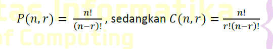
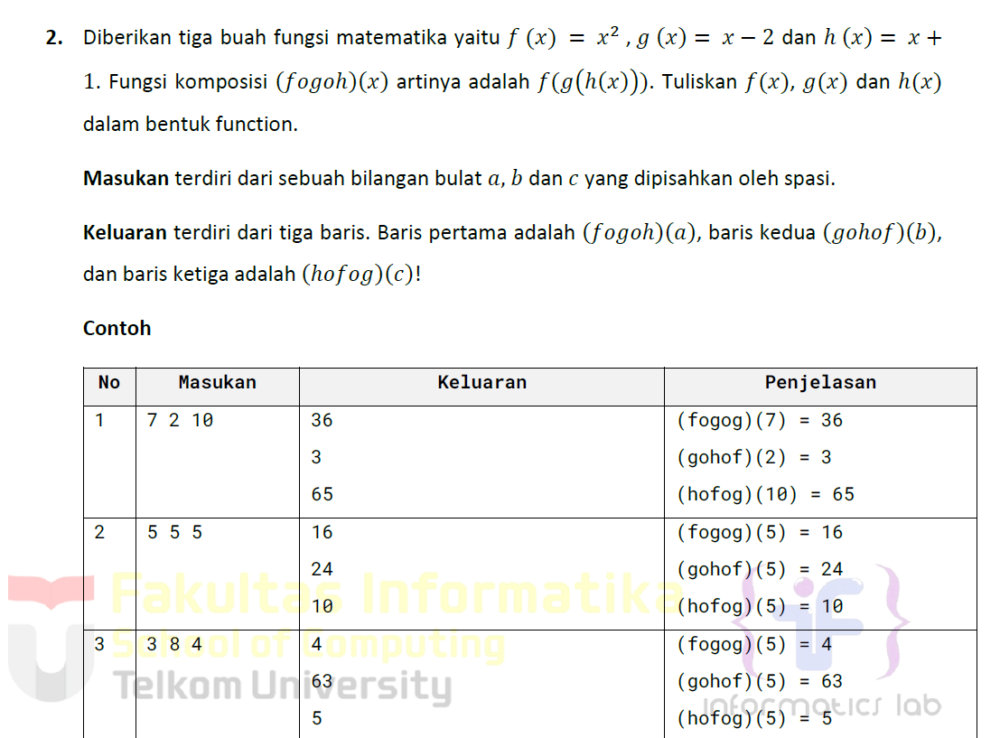
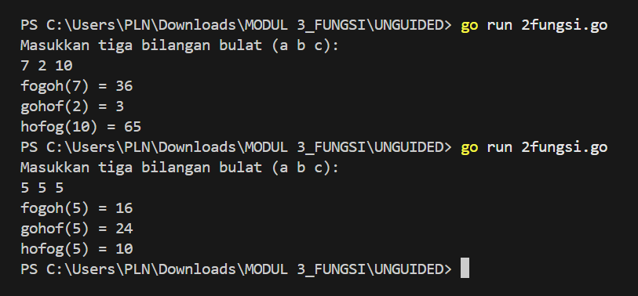
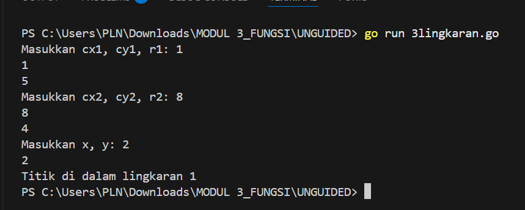

# <h1 align="center">Laporan Praktikum Modul 3 <br> FUNGSI</h1>
<p align="center">ESTETIKA ANANDA POETRI HARIYANTO - 103112400272</p>

## Dasar Teori

 Fungsi yaitu sekumpulan instruksi yang digunakan untuk mengolah data dan mengembalikan hasil dalam bentuk nilai tertentu. Fungsi ini biasanya digunakan untuk memetakan suatu input ke dalam output yang kita inginkan.
## Unguided

## NO 1

Minggu ini, mahasiswa Fakultas Informatika mendapatkan tugas dari mata kuliah matematika diskrit untuk mempelajari kombinasi dan permutasi. Jonas salah seorang mahasiswa, iseng untuk mengimplementasikannya ke dalam suatu program. Oleh karena itu bersediakah kalian membantu Jonas? (tidak tentunya ya :p)
Masukan terdiri dari empat buah bilangan asli 𝑎, 𝑏, 𝑐, dan 𝑑 yang dipisahkan oleh spasi, dengan syarat 𝑎≥ 𝑐 dan 𝑏≥ 𝑑.
Keluaran terdiri dari dua baris. Baris pertama adalah hasil permutasi dan kombinasi 𝒂 terhadap 𝑐, sedangkan baris kedua adalah hasil permutasi dan kombinasi 𝑏 terhadap 𝑑.
Catatan: permutasi (P) dan kombinasi (C) dari 𝑛 terhadap 𝑟 (𝑛≥𝑟) dapat dihitung dengan menggunakan persamaan berikut!
>


```go
package main

import (
    "fmt"
)
//fungsi hitung faktorial
func factorial(n int) int {
    if n == 0 || n == 1 {
        return 1
    }
    result := 1
    for i := 2; i <= n; i++ {
        result *= i
    }
    return result
}
//fungsi hitung permutasi
func permutation(n, r int) int {
    return factorial(n) / factorial(n-r)
}
//fungsi hitung kombinasi
func combination(n, r int) int {
    return factorial(n) / (factorial(r) * factorial(n-r))
}
func main() {
    var a, b, c, d int
    fmt.Print("masukkan nilai a, b, c, d (dipisahkan spasi): ")
    fmt.Scan(&a, &b, &c, &d)
//hasil
    fmt.Println(permutation(a, c), combination(a, c))
    fmt.Println(permutation(b, d), combination(b, d))
}
```

>Output
>

Program ini untuk menghitung permutasi dan kombinasi dari dua pasang angka yang diberikan sebagai input. pengguna memasukan empat angka yaitu a,b,c,d dengan syarat nya adalah a lebih besar sama dengan c & b lebih besar sama dengan d. nah program kemudian menghitung permutasi dan kombinasi pakai rumus. Permutasi menghitung jumlah cara mengatur r elemen dari n elemen yang sudah ada, sedangkan kombinasi menghitung jumlah cara memilih r elemen dari n elemen tanpa perhatiin urutan.
hasil menampilkan dalam 2 baris, baris pertama yaitu hasil untuk pasangan a,c dan baris kedua hasil untuk pasangan b,d

### NO 2

>

```go
package main

import (
    "fmt"
)
func f(x int) int {
    return x * x
}
func g(x int) int {
    return x - 2
}
func h(x int) int {
    return x + 1
}
func fogoh(x int) int {
    return f(g(h(x)))
}
func gohof(x int) int {
    return g(h(f(x)))
}
func hofog(x int) int {
    return h(f(g(x)))
}
func main() {
    var a, b, c int
    fmt.Println("Masukkan tiga bilangan bulat (a b c):")
    fmt.Scan(&a, &b, &c)
    fmt.Printf("fogoh(%d) = %d\n", a, fogoh(a))
    fmt.Printf("gohof(%d) = %d\n", b, gohof(b))
    fmt.Printf("hofog(%d) = %d\n", c, hofog(c))
}
```

> Output
>

Program ini menghitung komposisi 3 fungsi mtk :
f(x)=x2 (kuadrat dari x)
g(x)=x−2g(x) = x - 2g(x)=x−2 (mengurangi x dengan 2)
h(x)=x+1h(x) = x + 1h(x)=x+1 (menambah x dengan 1)

fogof(a) = f(g(h(a)))
gohof(b) = g(h(f(b)))
hofog(c) = h(f(g(c)))

### NO 3

Soal no 3
[>](https://github.com/Estetikahariyanto/ALPRO2_EstetikaAnandaPoetri_103112400272/blob/main/MODUL3_FUNGSI/gambarsoal/soal3.jpg)

```go
package main

import (
    "fmt"
    "math"
)
func jarak(a, b, c, d float64) float64 {
    return math.Sqrt(math.Pow(a-c, 2) + math.Pow(b-d, 2))
}
func dalamLingkaran(cx, cy, r, x, y float64) bool {
    return jarak(cx, cy, x, y) <= r
}
func main() {
    var cx1, cy1, r1 float64
    var cx2, cy2, r2 float64
    var x, y float64        
    fmt.Print("Masukkan cx1, cy1, r1: ")
    fmt.Scan(&cx1, &cy1, &r1)
    fmt.Print("Masukkan cx2, cy2, r2: ")
    fmt.Scan(&cx2, &cy2, &r2)
    fmt.Print("Masukkan x, y: ")
    fmt.Scan(&x, &y)
    dalam1 := dalamLingkaran(cx1, cy1, r1, x, y)
    dalam2 := dalamLingkaran(cx2, cy2, r2, x, y)
    if dalam1 && dalam2 {
        fmt.Println("Titik di dalam lingkaran 1 dan 2")
    } else if dalam1 {
        fmt.Println("Titik di dalam lingkaran 1")
    } else if dalam2 {
        fmt.Println("Titik di dalam lingkaran 2")
    } else {
        fmt.Println("Titik di luar lingkaran 1 dan 2")
    }
}
```

> Output
>

Program ini :
Fungsi jarak
    Menghitung jarak antara dua titik menggunakan rumus Euclidean Distance.
Fungsi dalamLingkaran
    Memeriksa apakah titik berada di dalam lingkaran dengan membandingkan jarak titik ke pusat lingkaran dengan radius.
Fungsi main (Program Utama)
    Mengambil input untuk dua lingkaran (pusat dan radius) serta titik yang akan dicek.
    Menggunakan fungsi dalamLingkaran untuk mengecek apakah titik berada dalam lingkaran pertama, kedua, atau keduanya. lalu mencetak hasil berdasarkan kondisi yang sesuai.


