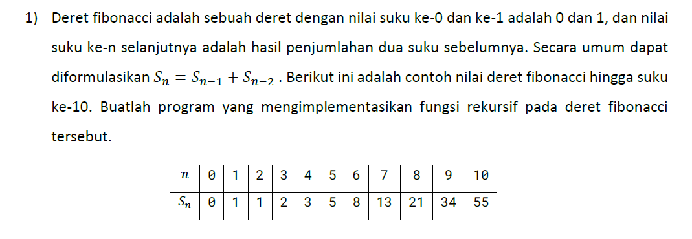
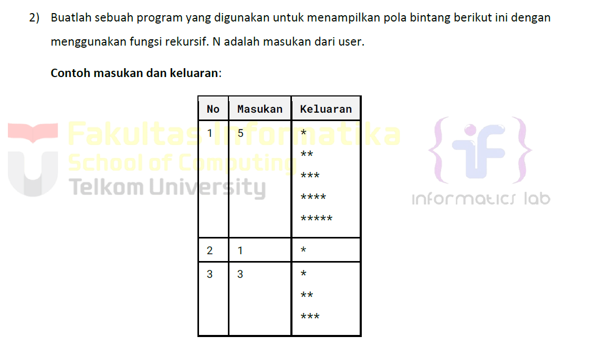
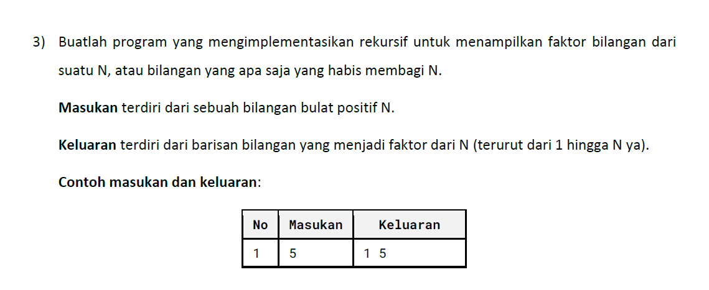
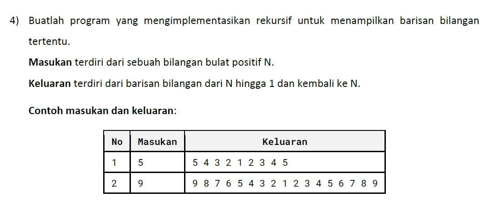
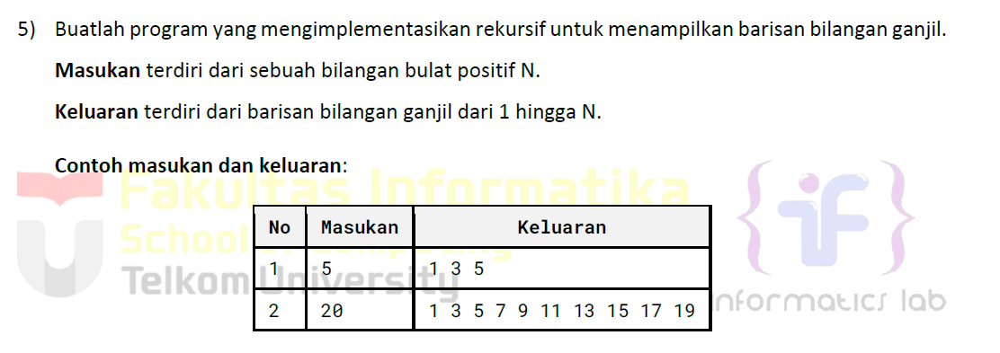
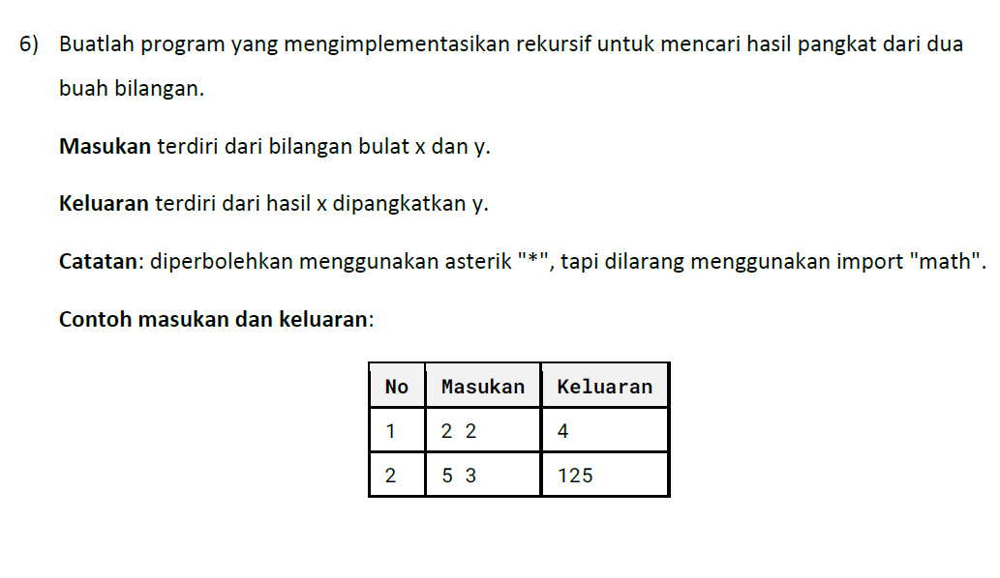

# <h1 align="center">Laporan Praktikum Modul 5 <br> REKURSIF</h1>
<p align="center">ESTETIKA ANANDA POETRI HARIYANTO - 103112400272</p>

## Dasar Teori

Rekursif adalah teknik pemrograman di mana suatu fungsi atau prosedur memanggil dirinya sendiri untuk menyelesaikan masalah yang lebih kecil dari masalah utama.

**Struktur Rekursif**  
Setiap algoritma rekursif terdiri dari dua bagian utama:
- Base-case: Kondisi penghentian rekursi agar tidak berjalan tanpa batas.
- Recursive-case: Kondisi di mana fungsi memanggil dirinya sendiri dengan parameter yang lebih sederhana

Forward: Pemanggilan rekursif terus berjalan hingga base-case terpenuhi
Backward: Setelah base-case tercapai, fungsi mulai kembali menyelesaikan pemanggilan sebelumnya.
## Unguided

## NO 1

>

```go
package main

import (
    "fmt"
)
var memo = map[int]int{0: 0, 1: 1}
func fibonacci(n int) int {
    if val, found := memo[n]; found {
        return val
    }
    memo[n] = fibonacci(n-1) + fibonacci(n-2)
    return memo[n]
}
func main() {
    n := 10 
    fmt.Println("deret Fibonacci hingga suku ke-10:")
    for i := 0; i <= n; i++ {
        fmt.Printf("fibonacci(%d) = %d\n", i, fibonacci(i))
    }
}
```

> Output


Program ini terdiri dari tiga bagian utama:

1. Deklarasi Map (memoization)
2. Fungsi Rekursif `fibonacci(n)` dengan Memoization
3. Fungsi `main()` untuk menampilkan hasil Fibonacci

- Inisialisasi Penyimpanan (Memoization)  
    Program menggunakan struktur data `map` untuk menyimpan nilai Fibonacci yang sudah dihitung. Awalnya, kita menetapkan bahwa:
    
    - `Fibonacci(0) = 0`
    - `Fibonacci(1) = 1` Sehingga, dua nilai ini tidak perlu dihitung ulang.
- Fungsi Rekursif dengan Memoization  
    Saat program diminta menghitung `Fibonacci(n)`, pertamaa program akan mengecek apakah nilai tersebut sudah ada dalam penyimpanan (`memo`).
    
    - Jika sudah ada, hasilnya langsung dikembalikan tanpa perhitungan ulang.
    - Jika belum ada, program akan menghitungnya dengan rumus `Fibonacci(n) = Fibonacci(n-1) + Fibonacci(n-2)`.
### NO 2

>

```go
package main

import (
    "fmt"
)
//fungsi rekursif
func printStars(n, i int) {
    if i > n {
        return
    }
    fmt.Println(string(makeStars(i)))
    printStars(n, i+1)
}
func makeStars(i int) []rune {
    stars := make([]rune, i)
    for j := range stars {
        stars[j] = '*'
    }
    return stars
}
func main() {
    var n int
    fmt.Print("masukkan angka: ")
    fmt.Scan(&n)
    printStars(n, 1)
}
```

> Output
> 

Program ini bertujuan untuk menampilkan pola segitiga bintang menggunakan rekursi.

Fungsi printStars(n, i)
i : mencetak bintang per baris
memanggil diri nya sendiri dengan i+1 hingga i>n

Fungsi makeStars(i)
membuat slice rune berisi i karakter *
digunakan utk mencetak bintang tanpa perlu loop

Fungsi main()
menerima input n dari pengguna
memanggil prinStars(n, 1) utk memulai rekursi

### NO 3

>

```go
package main
import (
    "fmt"
)
//fungsi rekursif
func printFactors(n, i int) {
    if i > n {
        return
    }
    if n%i == 0 {
        fmt.Print(i, " ")
    }
    printFactors(n, i+1)
}

func main() {
    var n int
    fmt.Print("masukkan bilangan: ")
    fmt.Scan(&n)
    fmt.Print("faktor dari ", n, ": ")
    printFactors(n, 1)
    fmt.Println()
}
```

> Output
> 

Program ini bertujuan untuk menampilkan faktor dari suatu bilangan N menggunakan rekursi dalam bahasa Go. Faktor dari suatu bilangan N adalah angka-angka yang dapat membagi N tanpa sisa.

Fungsi rekursif printFactors(n, i)
jika i lebih besar dari n, fungsi berhenti (return)
if n%i == 0 :
jika i bisa membagi n tanpa sisa (n % i == 0) maka i faktor n, sehingga ditampilkan (fmt.Print(i, ""))

manggil rekursif :
memanggil diri nya sendiri dengan i + 1 utk memeriksa angka berikutnya hingga mencapai n.

fungsi main()
meminta input N dari pengguna.
manggil printfactors(n,1) utk mulai mencari faktor dari 1 hingga N.

### NO 4

>

```go
package main

import (
    "fmt"
)

//fungsi rekursif
func printDescending(n, i int) {
    if i == 0 {
        return
    }
    fmt.Print(i, " ")
    printDescending(n, i-1)
}

//fungsi rekursif untuk mencetak dari 1 kembali ke N
func printAscending(i, n int) {
    if i > n {
        return
    }
    fmt.Print(i, " ")
    printAscending(i+1, n)
}
func main() {
    var n int
    fmt.Print("Masukkan bilangan: ")
    fmt.Scan(&n)
    printDescending(n, n)
    printAscending(2, n)
    fmt.Println()
}
```

> Output
> 

Program ini dibuat untuk menampilkan barisan bilangan dari N hingga 1, lalu kembali ke N menggunakan rekursi.

Fungsi printDescending(n, i)
jika i == 0, maka rekursi berhenti (return)
cetak i, panggil printDescending(n, i-1) utk mencetak angka sebelumnya.

Fungsi printAscending(i, n)
jika i > n, maka rekursi berhenti.
cetak i, panggil printAscending(i+1, n) utk mencetak angka sebelumnya.

Fungsi main()
- program meminta input N dari pengguna.
- memanggil printDescending(n, n) utk mencetak angka dari N ke 1.
- dan memanggil printAscending(2, n) utk mencetak angka dari 2 ke N.

### NO 5

>

```go
package main

import "fmt"

//fungsi rekursif untuk mencetak bilangan ganjil dari 1 hingga N
func printOdd(n, i int) {
    if i > n {
        return
    }
    fmt.Print(i, " ")
    printOdd(n, i+2) 
}
func main() {
    var n int
    fmt.Print("Masukkan bilangan: ")
    fmt.Scan(&n)
printOdd(n, 1)
    fmt.Println()
}
```

> Output
> 


Program untuk menampilkan barisan bilangan ganjil dari 1 hingga N menggunakan rekursi.

- Fungsi `printOdd(n, i)`
    
    - Mencetak angka ganjil `i` dari `1` hingga `N`.
        
    - Jika `i > N`, maka rekursi berhenti.
        
    - Jika `i` masih dalam batas, cetak `i` lalu panggil `printOdd(n, i+2)` untuk mencetak angka ganjil berikutnya.
        
- Fungsi `main()`
    
    - Meminta input `N` dari pengguna.
        
    - Memanggil `printOdd(n, 1)`, dimulai dari `1` sebagai bilangan ganjil pertama.

### NO 6

>

```go
package main

import "fmt"

//fungsi rekursif untuk menghitung x pangkat y
func power(x, y int) int {
    //basis: jika y == 0, maka hasilnya 1 (x^0 = 1)
    if y == 0 {
        return 1
    }
    //rekursi: x^y = x * x^(y-1)
    return x * power(x, y-1)
}

func main() {
    var x, y int
    fmt.Print("Masukkan bilangan x: ")
    fmt.Scan(&x)
    fmt.Print("Masukkan bilangan y: ")
    fmt.Scan(&y)

    //memanggil fungsi rekursif power(x, y)
    result := power(x, y)
    fmt.Printf("%d pangkat %d adalah %d\n", x, y, result)
}
```

> Output
> 

Program yang mengimplementasikan rekursi untuk menghitung x^y (x pangkat y) tanpa menggunakan library math.

Fungsi power (x,y) > rekursif
- jika y == 0, maka hasilnya 1 (krna x^0 = 1)
- jika y > 0, maka gunakan rumusnya x^y = x*x^ (y-1).
- fungsi terus dipanggil hingga mencapai y = 0.

Fungsi main()
- pengguna meminta input x dan y.
- memanggil fungsi power(x, y)


