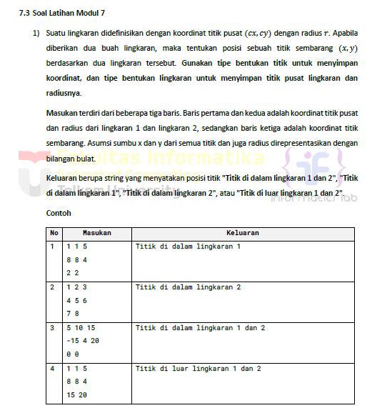
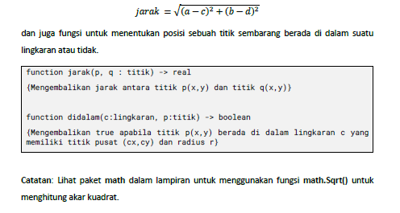
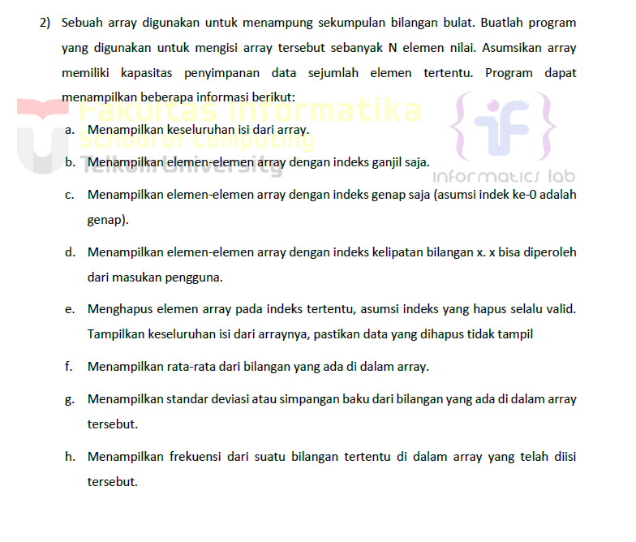
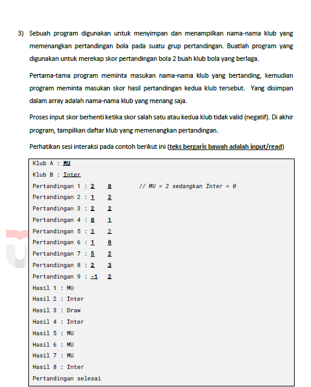
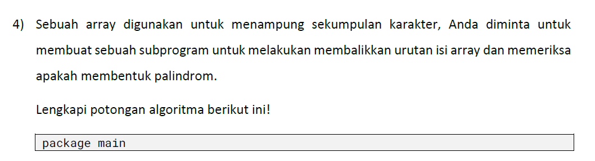
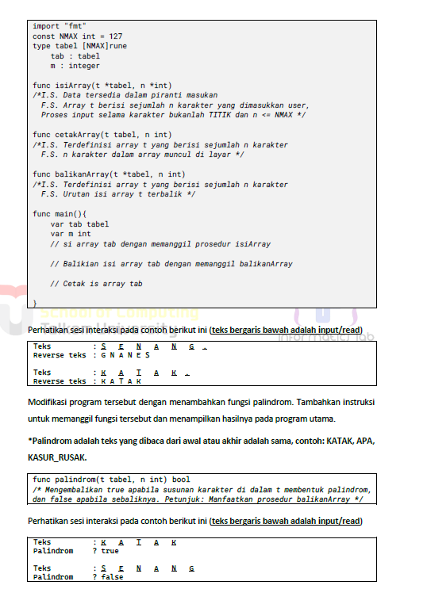

# <h1 align="center">Laporan Praktikum Modul 7 <br> STRUCT ARRAY</h1>
<p align="center">ESTETIKA ANANDA POETRI HARIYANTO - 103112400272</p>

## Dasar Teori

Tipe bentukan memungkinkan pemrograman untuk mendefinisikan suatu tipe data baru pada suatu bahasa pemrograman. Tipe bentukan ini dapat dibedakan atas dua jenis, yaitu Alias dan Struct.

Alias (Type)
Bahasa pemrograman pada umumnya mengizinkan pemrograman untuk mengubah nama suatu tipe data dengan nama baru yang lebih ringkas dan familiar. Sebagai contoh "integer" dapat dirubah dengan nama alias "bilangan ". Caranya dengan menggunakan kata kunci "type".

Struct (structure) itu kotak yang bisa nyimpen beberapa jenis data yang beda-beda.
Contoh: nyimpen data mahasiswa seperti, NIM, IPK.

## Unguided

## NO 1

>

>
```go
package main

import (
    "fmt"
    "math"
)

type Titik struct {
    x int
    y int
}

type Lingkaran struct {
    pusat Titik
    r     int
}
func jarak(p1, p2 Titik) float64 {
    return math.Sqrt(math.Pow(float64(p1.x-p2.x), 2) + math.Pow(float64(p1.y-p2.y), 2))
}
func dalamLingkaran(l Lingkaran, p Titik) bool {
    return jarak(l.pusat, p) <= float64(l.r)
}
func main() {
    var lingkaran1, lingkaran2 Lingkaran
    var titik Titik
    fmt.Scan(&lingkaran1.pusat.x, &lingkaran1.pusat.y, &lingkaran1.r)
    fmt.Scan(&lingkaran2.pusat.x, &lingkaran2.pusat.y, &lingkaran2.r)
    fmt.Scan(&titik.x, &titik.y)
    dalam1 := dalamLingkaran(lingkaran1, titik)
    dalam2 := dalamLingkaran(lingkaran2, titik)
    if dalam1 && dalam2 {
        fmt.Println("Titik di dalam lingkaran 1 dan 2")
    } else if dalam1 {
        fmt.Println("Titik di dalam lingkaran 1")
    } else if dalam2 {
        fmt.Println("Titik di dalam lingkaran 2")
    } else {
        fmt.Println("Titik di luar lingkaran 1 dan 2")
    }
}
```

>Output


- Titik: struct untuk menyimpan koordinat titik (x, y)
- Lingkaran: struct untuk menyimpan pusat dan jari-jari lingkaran
- Fungsi:
jarak(p1, p2 Titik) float64: menghitung jarak antar dua titik
dalamLingkaran(l Lingkaran, p Titik) bool: mengecek apakah titik p berada di dalam lingkaran l

Keluaran berupa string yang menyatakan posisi titik "Titik di dalam lingkaran 1 dan 2", "Titik di dalam lingkaran 1", "Titik di dalam lingkaran 2", atau "Titik di luar lingkaran 1 dan 2".
## NO 2

>

```go
package main

import (
    "fmt"
    "math"
)

//struct untuk menyimpan array bilangan bulat

type DataArray struct 
    data []int
}

//menampilkan seluruh isi array
func (d DataArray) TampilkanSemua() {
    fmt.Println("Isi array:", d.data)
}

//menampilkan elemen dengan indeks ganjil
func (d DataArray) TampilkanIndeksGanjil() {
    fmt.Print("Indeks ganjil: ")
    for i := 1; i < len(d.data); i += 2 {
        fmt.Print(d.data[i], " ")
    }
    fmt.Println()
}

//menampilkan elemen dengan indeks genap
func (d DataArray) TampilkanIndeksGenap() {
    fmt.Print("Indeks genap: ")
    for i := 0; i < len(d.data); i += 2 {
        fmt.Print(d.data[i], " ")
    }
    fmt.Println()
}

//menampilkan elemen dengan indeks kelipatan x
func (d DataArray) TampilkanIndeksKelipatan(x int) {
    fmt.Printf("Indeks kelipatan %d: ", x)
    for i := 0; i < len(d.data); i++ {
        if i%x == 0 {
            fmt.Print(d.data[i], " ")
        }
    }
    fmt.Println()
}

//menghapus elemen pada indeks tertentu
func (d *DataArray) HapusIndeks(i int) {
    if i < 0 || i >= len(d.data) {
        fmt.Println("Indeks tidak valid!")
        return
    }
    d.data = append(d.data[:i], d.data[i+1:]...)
    fmt.Println("Setelah dihapus:")
    d.TampilkanSemua()
}

//menghitung rata-rata
func (d DataArray) RataRata() float64 {
    total := 0
    for _, val := range d.data {
        total += val
    }
    return float64(total) / float64(len(d.data))
}

//menghitung standar deviasi
func (d DataArray) StandarDeviasi() float64 {
    rata := d.RataRata()
    var total float64
    for _, val := range d.data {
        total += math.Pow(float64(val)-rata, 2)
    }
    return math.Sqrt(total / float64(len(d.data)))
}

//menghitung frekuensi suatu nilai
func (d DataArray) Frekuensi(nilai int) int {
    count := 0
    for _, val := range d.data {
        if val == nilai {
            count++
        }
    }
    return count
}
func main() {
    var n int
    fmt.Print("Masukkan jumlah elemen array: ")
    fmt.Scan(&n)
    arr := DataArray{data: make([]int, n)}
    fmt.Println("Masukkan elemen array:")
    for i := 0; i < n; i++ {
        fmt.Scan(&arr.data[i])
    }
    arr.TampilkanSemua()
    arr.TampilkanIndeksGanjil()
    arr.TampilkanIndeksGenap()
    
    //tampilkan indeks kelipatan x
    var x int
    fmt.Print("Masukkan bilangan untuk kelipatan indeks: ")
    fmt.Scan(&x)
    arr.TampilkanIndeksKelipatan(x)

    //hapus indeks tertentu
    var idx int
    fmt.Print("Masukkan indeks yang ingin dihapus: ")
    fmt.Scan(&idx)
    arr.HapusIndeks(idx)

    //rata-rata
    fmt.Printf("Rata-rata: %.2f\n", arr.RataRata())

    //standar deviasi
    fmt.Printf("Standar deviasi: %.2f\n", arr.StandarDeviasi())

    //frekuensi nilai tertentu
    var cari int
    fmt.Print("Masukkan bilangan yang ingin dicari frekuensinya: ")
    fmt.Scan(&cari)
    fmt.Printf("Frekuensi %d: %d kali\n", cari, arr.Frekuensi(cari))
}
```

>Output


Program ini dibuat untuk:
Menyimpan sekumpulan bilangan bulat dalam array.
Menampilkan dan mengolah array tersebut berdasarkan perintah tertentu.
Semua operasi ditampung dalam struct agar rapi dan mudah dipakai.

Fungsi fungsi :
1. Tampilkansemua() yaitu menampilkan seluruh elemen array.
2. Tampilkanindeksganjil() yaitu menampilkan elemen yang berada di indeks ganjil, arr[1] dll
3. Tampilkanindeksgenap() yaitu menampilkan elemen yang berada di indeks genap, misal arr[2] dll
4. Tampilkanindekskelipatan(x int) yaitu menampilkan elemen pada indeks kelipatan x, seperti x=3 menjadi elemen indeks 0,3,6 dll
5. Hapusindeks(i int) yaitu menghapus elemen pada indeks i dari array
d.data = append(d.data[:i], d.data[i+1:]...)
untuk memotong elemen pada indeks itu
6. RataRata() yaitu untuk menghitung rata rata dari seluruh nilai di dalam array.
7. Standardeviasi() yaitu untuk menghitung simpangan baku dari rumus
8. Frekuensi(nilai int) utk menghitung berapa kali suatu bilangan muncul di dlm array.
## NO 3

>

```go
package main

import (
    "fmt"
)

//struct untuk menyimpan informasi klub
type Klub struct {
    nama string
}

//struct untuk menyimpan hasil pertandingan
type Pertandingan struct {
    skorA int
    skorB int
}

//fungsi utama
func main() {
    var klubA, klubB Klub
    var hasil []string
    var pertandingan []Pertandingan

    //input nama klub
    fmt.Print("Klub A : ")
    fmt.Scan(&klubA.nama)
    fmt.Print("Klub B : ")
    fmt.Scan(&klubB.nama)
    
    //input skor hingga skor negatif
    i := 1
    for {
        var p Pertandingan
        fmt.Printf("Pertandingan %d : ", i)
        fmt.Scan(&p.skorA, &p.skorB)

        //cek jika ada skor negatif → berhenti
        if p.skorA < 0 || p.skorB < 0 {
            fmt.Println("Pertandingan selesai")
            break
        }

        //simpan hasil pertandingan ke slice
        pertandingan = append(pertandingan, p)
        
        // Cek hasil pertandingan
        if p.skorA > p.skorB {
            hasil = append(hasil, klubA.nama)
        } else if p.skorB > p.skorA {
            hasil = append(hasil, klubB.nama)
        } else {
            hasil = append(hasil, "Draw")
        }
        i++
    }

    //tampilkan hasil rekap
    for j, h := range hasil {
        fmt.Printf("Hasil %d : %s\n", j+1, h)
    }
}
```

>Output


Program ini untuk merekap skor pertandingan bola 2 buah klub bola yang berlaga.
Pertama-tama program meminta masukan nama-nama klub yang bertanding, kemudian program meminta masukan skor hasil pertandingan kedua klub tersebut. Yang disimpan dalam array adalah nama-nama klub yang menang saja.
Proses input skor berhenti ketika skor salah satu atau kedua klub tidak valid (negatif). Di akhir program, tampilkan daftar klub yang memenangkan pertandingan.

- `Klub` menyimpan nama klub.
- `Pertandingan` menyimpan skor masing-masing klub.
- Program **berhenti saat skor negatif** dimasukkan.    
- Semua hasil disimpan dalam **slice hasil[]** yang berisi nama klub pemenang atau `"Draw"`.
- Setelah input selesai, ditampilkan semua hasilnya satu per satu.

## NO 4

>

>
```go
package main
import (
    "fmt"
)

//konstanta maksimum panjang array
const NMAX int = 127

//struct Tabel, menyimpan array karakter dan panjang isi array
type Tabel struct {
    tab [NMAX]rune
    n   int
}

//fungsi input isi array
func isiArray(t *Tabel) {
    fmt.Print("Masukkan teks (tanpa spasi): ")
    var input string
    fmt.Scanln(&input)
    t.n = len(input)
    for i, ch := range input {
        t.tab[i] = ch
    }
}

//fungsi mencetak isi array
func cetakArray(t Tabel) {
    for i := 0; i < t.n; i++ {
        fmt.Printf("%c ", t.tab[i])
    }
    fmt.Println()
}

//fungsi membalik isi array
func balikArray(t *Tabel) Tabel {
    var hasil Tabel
    hasil.n = t.n
    for i := 0; i < t.n; i++ {
        hasil.tab[i] = t.tab[t.n-1-i]
    }
    return hasil
}

//fungsi untuk mengecek apakah array adalah palindrom
func palindrome(t Tabel) bool {
    for i := 0; i < t.n/2; i++ {
        if t.tab[i] != t.tab[t.n-1-i] {
            return false
        }
    }
    return true
}
  
//fungsi utama
func main() {
    var t Tabel
    
    //input array karakter
    isiArray(&t)

    //cetak array asli
    fmt.Print("Teks asli     : ")
    cetakArray(t)

    //balik isi array dan cetak
    tBalik := balikArray(&t)
    fmt.Print("Teks reverse  : ")
    cetakArray(tBalik)

    //cek apakah palindrom
    if palindrome(t) {
        fmt.Println("Palindrome    : true")
    } else {
        fmt.Println("Palindrome    : false")
    }
}
```

>Output


Program ini untuk membuat sebuah subprogram untuk melakukan membalikkan urutan isi array dan memeriksa apakah membentuk palindrom.

- Struct `Tabel`: Menyimpan array karakter dan panjangnya.
- `isiArray`: Meminta input dari user.
- `cetakArray`: Mencetak array karakter.
- `balikArray`: Mengembalikan array dengan isi terbalik.
- `palindrome`: Mengecek apakah isi array palindrom.
- `main`: Menjalankan semua proses secara berurutan.``


